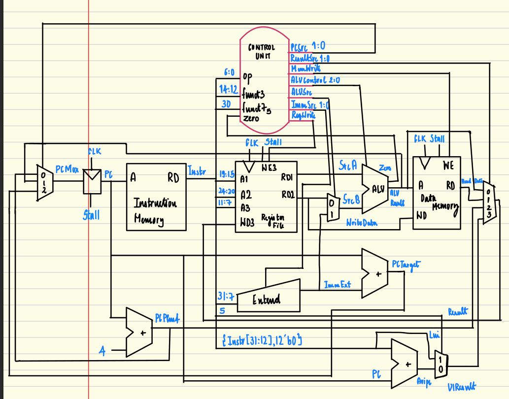

# RISC-V Core Architecture

This document details the microarchitecture of the single-cycle RV32I processor.

## 1. Datapath

The processor uses a classic single-cycle datapath, optimized for the base integer (RV32I) instruction set. Stalls have been introduced to enable them to be run in FPGA with real-time memory hierarchy.

---

## 2. Control Unit Logic

The Control Unit is a combinational logic block that decodes the instruction's opcode to generate the primary control signals for the datapath.

### 2.1. Main Decoder

This truth table defines the outputs of the main decoder based on the instruction's opcode and funct3. This implementation supports R-type, I-type (ALU immediate and load), S-type (store), B-type (branch), J-type (jump) and U-type (upper immediate) instructions.

| Instruction | Opcode | RegWrite | ImmSrc |ALUSrc | MemWrite | ResultSrc | ALUOp | Jump | Jalr |
| :---: | :---: | :---: | :---: | :---: | :---: | :---: | :---: | :---: | :----: |
| R-type | `0110011` | 1 | xx | 0 | 0 | 00 | 10 | 0 | 0 |
| `lw` | `0000011` | 1 | 00 | 1 | 0 | 01 | 00 | 0 | 0 |
| `sw` | `0100011` | 0 | 01 | 1 | 1 | xx | 00 | 0 | 0 |
| `branch` | `1100011` | 0 | 10 | 0 | 0 | xx | 01 | 0 | 0 |
| I-type ALU | `0010011` | 1 | 00 | 1 | 0 | 00 | 10 | 0 | 0 |
| `jal` | `1101111` | 1 | 11 | 0 | 0 | 10 | 00 | 1 | 0 |
| `jalr` | `1100111` | 1 | 00 | 1 | 0 | 10 | 00 | 0 | 1 |
| `auipc` | `0010111` | 1 | 11 | 0 | 0 | 00 | 00 | 0 | 0 |
| `lui` | `0110111` | 1 | 11 | x | 0 | 11 | xx | 0 | 0 |

### Branch Instructions Decoding

| Branch Type | Opcode | funct3 | Condition | Description |
| :---: | :---: | :---: | :---: | :---: |
| `beq` | `1100011` | `000` | Zero | Branch if equal |
| `bne` | `1100011` | `001` | !Zero | Branch if not equal |
| `blt` | `1100011` | `100` | ALUR31 | Branch if less than (signed) |
| `bge` | `1100011` | `101` | !ALUR31 | Branch if greater/equal (signed) |
| `bltu` | `1100011` | `110` | Overflow | Branch if less than (unsigned) |
| `bgeu` | `1100011` | `111` | !Overflow | Branch if greater/equal (unsigned) |

---

### 2.2. ALU Decoder

The ALU Decoder generates the final `ALUControl` signal for the ALU based on the `ALUOp` from the main decoder and the instruction's `funct3` and `funct7` fields.

| ALUOp | funct3 | funct7[5] | ALUControl | Operation |
| :---: | :----: | :-------: | :--------: | :-------: |
| `00` | `xxx` | `x` | `000` | ADD |
| `01` | `xxx` | `x` | `001` | SUB |
| `10` | `000` | `0` | `000` | ADD |
| `10` | `000` | `1` | `001` | SUB |
| `10` | `001` | `x` | `010` | SLL |
| `10` | `010` | `x` | `011` | SLT |
| `10` | `011` | `x` | `100` | SLTU |
| `10` | `100` | `x` | `101` | XOR |
| `10` | `101` | `0` | `110` | SRL |
| `10` | `101` | `1` | `111` | SRA |
| `10` | `110` | `x` | `110` | OR |
| `10` | `111` | `x` | `111` | AND |

---

## 3. Verification Example

The following table shows an example of how a short assembly program is converted to machine code for execution on the core.

| Address | Assembly Instruction | Type | op | rs1 | rs2 | rd | funct3 | funct7 / imm | Machine Code |
| :--- | :--- | :---: | :---: | :---: | :---: | :---: | :---: | :--- | :--- |
| `0x00` | `addi x5, x0, 10` | I | `0010011` | `00000` | `xxxxx` | `00101` | `000` | `00000001010` | `0x00A00293` |
| `0x04` | `addi x6, x0, 20` | I | `0010011` | `00000` | `xxxxx` | `00110` | `000` | `00000010100` | `0x01400313` |
| `0x08` | `add x7, x5, x6` | R | `0110011` | `00101` | `00110` | `00111` | `000` | `0000000` | `0x006283B3` |
| `0x0C` | `sw x7, 0(x0)` | S | `0100011` | `00000` | `00111` | `xxxxx` | `010` | `0000000` | `0x00702023` |

---